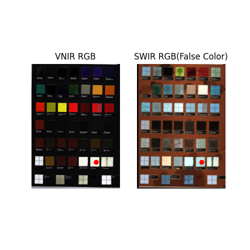
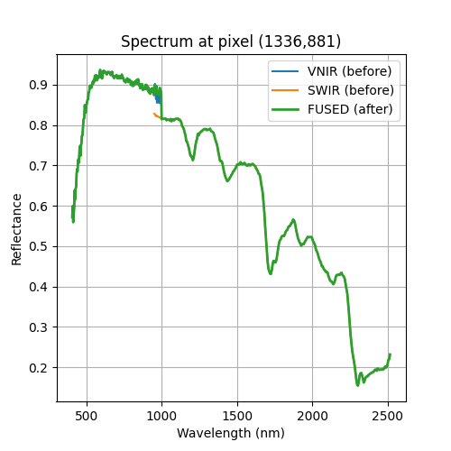
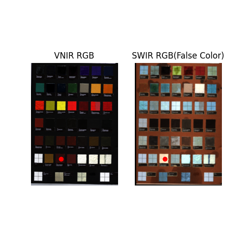
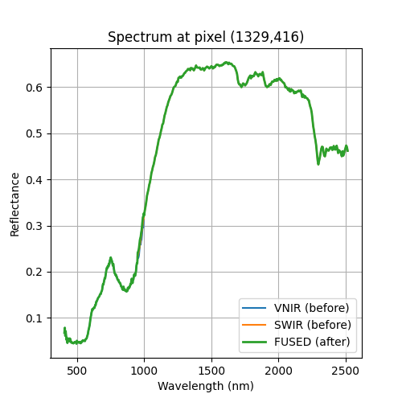
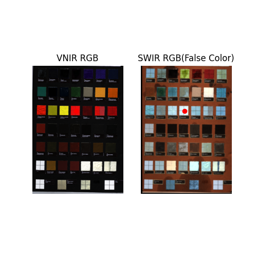
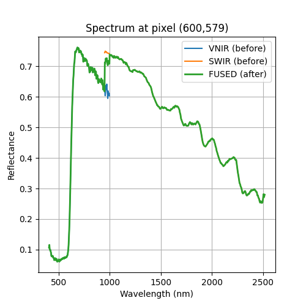
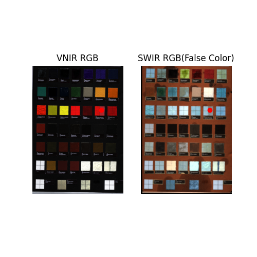
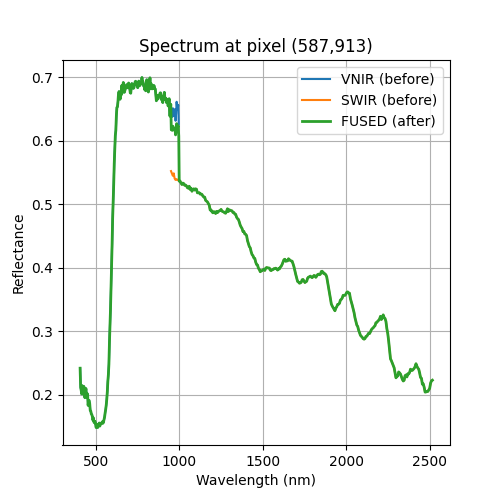

# VNIR–SWIR Hyperspectral Fusion 

## Introduction

This project presents a complete pipeline for fusing hyperspectral data acquired from two complementary sensors: VNIR (Visible and Near Infrared) and SWIR (Short-Wave Infrared). Due to differences in spatial resolution, radiometric response, and spectral coverage, direct fusion is non-trivial. We propose a processing pipeline consisting of calibration, spectral alignment, registration, radiometric correction, and spectral fusion to produce a geometrically aligned and spectrally consistent hyperspectral cube.

---

## Dataset

The dataset consists of:

- HySpex VNIR 1800 hyperspectral cube

- HySpex SWIR 384 hyperspectral cube

Due to large size (~4GB), data is not included in this repository and is stored externally in Google Drive.

---

## Methodology

### 1. Radiometric Calibration

Both VNIR and SWIR cubes are converted to relative reflectance using a pseudo-white reference extracted from the pigment checker scene.

---

### 2. Preprocessing

- Cropping to pigment checker region (removal of background)

- Spatial resizing of SWIR to match VNIR resolution

- Selection of overlapping spectral range (951–1000 nm)

---

### 3. Registration

Registration is performed using a hybrid strategy:

- PCA applied to overlap bands

- First principal component (PC1) used for structural representation

- SIFT feature matching for keypoint extraction

- RANSAC for outlier removal

- Initial affine transformation estimation

- Mutual Information (MI) optimization for refinement

This ensures robust multimodal alignment between VNIR and SWIR data.

---

### 4. Spectral Fusion

After alignment:

- SWIR spectra are resampled to VNIR wavelength grid

- Multiplicative radiometric correction is applied in overlap region

- Final fusion is performed using weighted averaging in overlap bands

---

### 5. Evaluation Metrics

- **NMI (Normalized Mutual Information)** → registration quality

- **ERGAS** → radiometric/geometric consistency

- **MAD (Mean Absolute Difference)** → spectral fusion error

---

## Results

### Registration Performance

- NMI increased after alignment

- ERGAS significantly reduced

### Fusion Performance

- MAD reduced after radiometric correction

- Smooth spectral transition in overlap region
### Spectral Fusion Result

## Dataset

The hyperspectral dataset (VNIR 1800 and SWIR 384) is not included in this repository due to its large size (~4GB).

It can be downloaded from Google Drive:

https://drive.google.com/drive/folders/1atJEfwmer588Qk464q-Agkps0qFTr_JD?usp=drive_link

After downloading, place the files in:

data/
├── VNIR_cropped_cube.npy
├── SWIR_aligned_cube.npy
├── VNIR_wavelength.npy
└── SWIR_wavelength.npy

